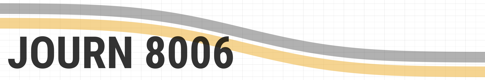

Course repository for *JOURN 8006: Quantitative Research Methods in Journalism*,
a graduate course in the Missouri School of Journalism.

## Syllabus
View [the course syllabus](syllabus/syllabus.md).

## Slides (rmarkdown files)
1. **Intro to quantitative research**
   1. [Quant Research](slides/01-intro-to-quant.Rmd)
1. **Variables and examples**
   1. [Variables](slides/02-variables.Rmd)
   1. [Examples (abstracts)](slides/02-abstracts.Rmd)
1. **Surveys** (no slides)
1. **Experiments**
   1. [Experiments](slides/04-experiments.Rmd)
1. **Content and text analysis**
   1. [Content/Text Analysis](slides/05-content-analysis.Rmd)
1. **Intro to R**
   1. [\#rstats](slides/06-rstats.Rmd)
1. **Descriptive statistics and rmarkdown**
   1. [Descriptives](slides/07-descriptives.Rmd)
   1. [Rmarkdown](slides/07-rmarkdown.Rmd)
1. **Chi-Squared, t-test, and exam review**
   1. [Chi-Squared test](slides/08-chisquare.Rmd)
   1. [t-tests](slides/08-ttests.Rmd)
   1. Exam review
      1. [Exam I Review](slides/8-examI.Rmd)
      1. [Exam I Review (supplemental)](slides/08-examI-descriptives.Rmd)
1. **Exam I**
1. **Correlations and intro to factors**
   1. [Correlations](slides/10-correlation.Rmd)
   1. [Factors](slides/10-factors.Rmd)
1. **Spring Break**
1. **Intro to the general linear model**
   1. [General linear model](slides/12-lm.Rmd)
1. **Linear models and research projects**
   1. [Model interpretation and diagnostics](slides/13-models.Rmd)
   1. [Project Hypotheses](slides/13-projects.Rmd)

## Texts
- [*Mass Media Research: An
Introduction*](https://www.amazon.com/dp/143908274X/) by Roger D. Wimmer and
Joseph R. Dominick. [See chapter outline](books/mass_media_outline.md)
- [*R for Data Science*](http://r4ds.had.co.nz/) by Garrett Grolemund and Hadley
Wickham

## Additional resources

### IRB training
Students must receive IRB certification for Social Behavioral Research. To complete this within the University of Missouri system, follow [these instructions for completing IRB training](resources/irb_training/instructions.md).

### Installing R/Rstudio
Guide to [downloading R and
Rsstudio](resources/download-R-and-Rstudio/download-R-and-rstudio.Rmd)

### Learning R
A [collection of instructional videos for learning R](https://github.com/mkearney/learnRvideos)

### FAQ
Answers to [frequently asked questions](FAQ.md)

<!---->
