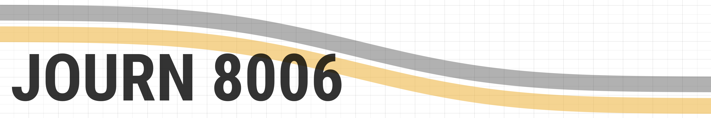

Course repository for *JOURN 8006: Quantitative Research Methods in Journalism*,
a graduate course in the Missouri School of Journalism.

## Syllabus
View [the course syllabus](syllabus/syllabus.md) or download the
[pdf](syllabus/syllabus.pdf) version.

## IRB training
Students must receive IRB certification for Social Behavioral Research. See:
[instructions for completing IRB training](irb_training/instructions.md).

## Installing R/Rstudio
Guide to [downloading R and
Rsstudio](download-R-and-Rstudio/download-R-and-rstudio.Rmd)

## FAQ
Answers to [frequently asked questions](FAQ.md)

## Slides (Rmd files)
1. [Quant Research](slides/1-intro-to-quant.Rmd)
2. [Variables](slides/2-variables.Rmd), [Abstracts](slides/2-abstracts.Rmd)
3. **Surveys** (no slides)
4. [Experiments](slides/experiments.Rmd)
5. [Content/Text Analysis](slides/5-content-analysis.Rmd)
6. [\#rstats](slides/6-rstats.Rmd)
7. [Descriptives](slides/7-descriptives.Rmd),
[Rmarkdown](slides/7-rmarkdown.Rmd)
8. [Chi-Squared test](slides/8-chisquare.Rmd), [Exam I Review
(supplemental)](slides/8-examI-descriptives.Rmd), [Exam I
Review](slides/8-examI.Rmd), [t-tests](slides/8-ttests.Rmd)
9. **Exam I** (no slides)
10. [Correlations](slides/10-correlation.Rmd), [Factors](slides/10-factors.Rmd)
11. **Spring Break** (no slides)
12. [General linear model](slides/12-lm.Rmd)
13. [Advanced models](slides/13-models.Rmd), [Project Hypotheses](slides/13-hrq.Rmd)

## Texts
- [*Mass Media Research: An
Introduction*](https://www.amazon.com/dp/143908274X/) by Roger D. Wimmer and
Joseph R. Dominick. [See chapter outline](books/mass_media_outline.md)
- [*R for Data Science*](http://r4ds.had.co.nz/) by Garrett Grolemund and Hadley
Wickham
