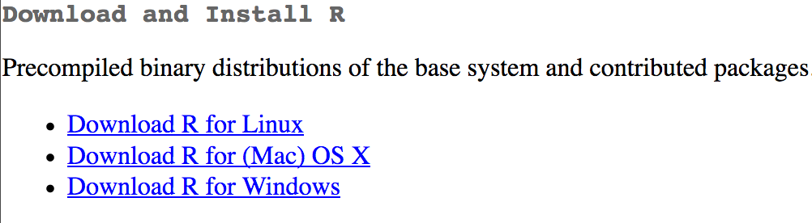
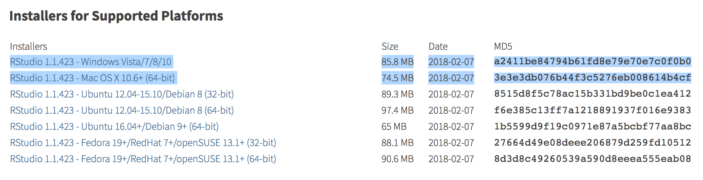

## Download R

1. Go to the CRAN (Collective R Archive Network) website: [https://cran.r-project.org/](https://cran.r-project.org/)

2. Click on the appropriate operating system (Mac or Windows) to navigate to download page.

3. Download the most recent version of R. If Mac, select the first `.pkg` file listed in the "files" section (e.g., `R-3.4.3.pkg`). If Windows, select "base" (it's the same link as the bolded message about 'installing R for the first time').

4. Double (run) click downloaded file (check `Downloads` folder). Click yes through prompts to install like any other program. You *may* get a warning about the source of the download being unkown. Do whatever you can to allow the installation to continue---I promise the R pkg file is safe!

## Download Rstudio

1. Go to the free download location on Rstudio's website: [https://www.rstudio.com/products/rstudio/download/#download](https://www.rstudio.com/products/rstudio/download/#download)

2. Select one of the highlighted options that corresponds with your computer's operating system (Mac or PC)

3. Double (run) click downloaded file (check `Downloads` folder). Click yes through prompts to install like any other program. You *may* get a warning about the source of the download being unkown. Do whatever you can to allow the installation to continue---I promise the R pkg file is safe!

## Using R/Rstudio

**R** is the language/environment (the engine).

**Rstudio** is the graphpical user interface (GUI) that makes it easy to use R.

Once both are installed, you can ignore R and only open/use Rstudio moving forward (Rstudio will use R, but you won't have to interact with it directly).
