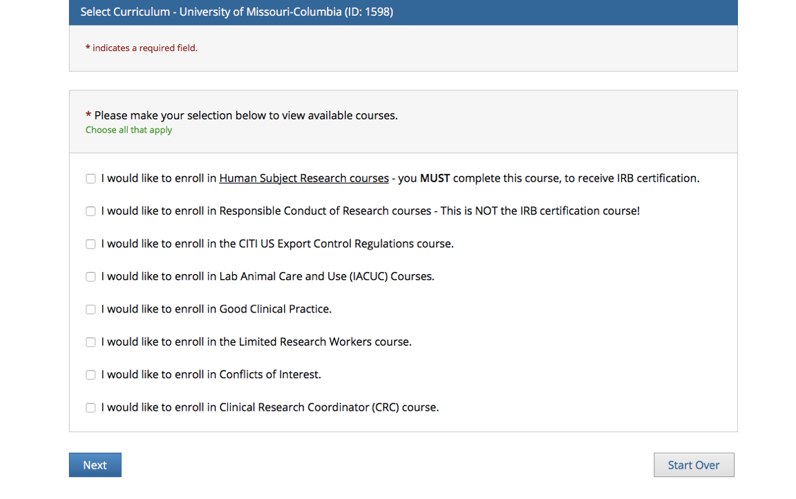
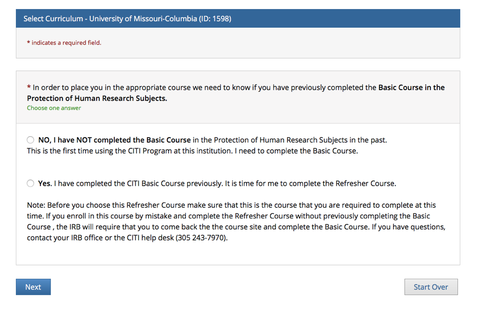
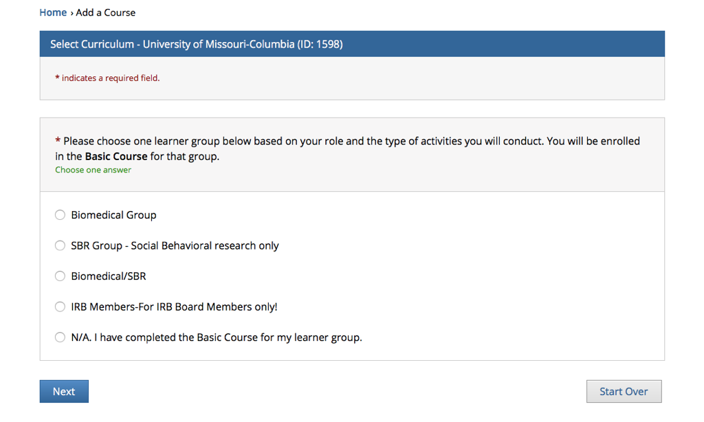
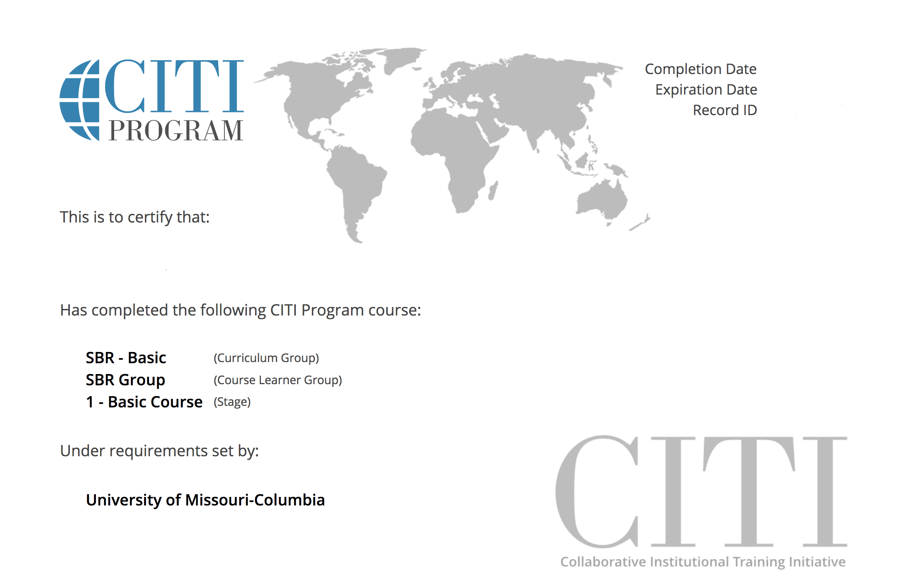

This document contains instructions for achieving IRB certification in the area of Social Behavioral research.

1. Login to Mizzou's eCompliance site (URL: https://ecompliance.missouri.edu/login)
2. Select "Institutional Review Board" (URL: https://ecompliance.missouri.edu/irb)
3. Under "Prerequisites" select "IRB Training" (URL: https://ecompliance.missouri.edu/my/irb/training)
4. Click "Sign into CITI Program" (URL: https://research.missouri.edu/citi-training/login.php)
5. The above step should redirect you to Shibboleth Identity; enter your Mizzou credentials to proceed to CITI site.
6. Under "Curriculum - University of Missouri-Columbia", click "add course"
7. Enroll in the required "Human Subject Research courses" (first option in screen shot below) and click "Next".

8. It should ask if you have previously completed the Basic Course in the Protection of Human Research Subjects. If you haven't done this **at Mizzou** previously, select "NO, I have NOT completed the Basic Course".

9. Select SBR Group - Social Behavioral research only.

10. Complete the module quizzes as instructed on the CITI website. You must complete all quizzes with a minimum of 80% correct responses.
11. Once you've completed the required training, download a printable certificate, which be available under "My Records" on the CITI website, and upload it to the assignments link on Canvas. It should look something like this:

 
