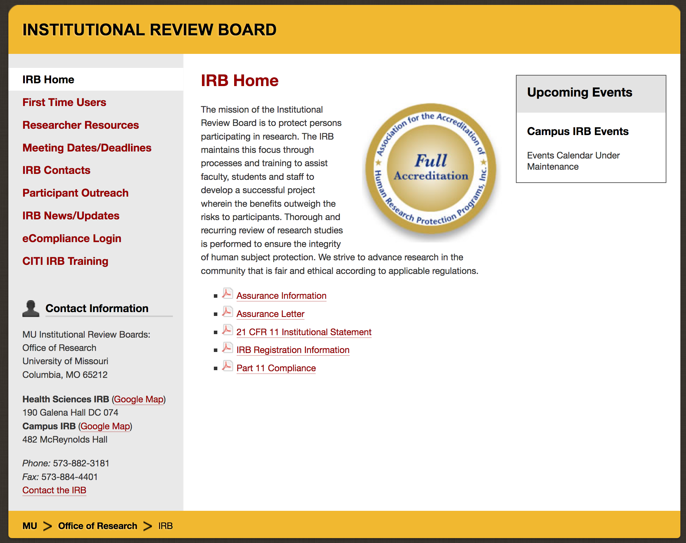
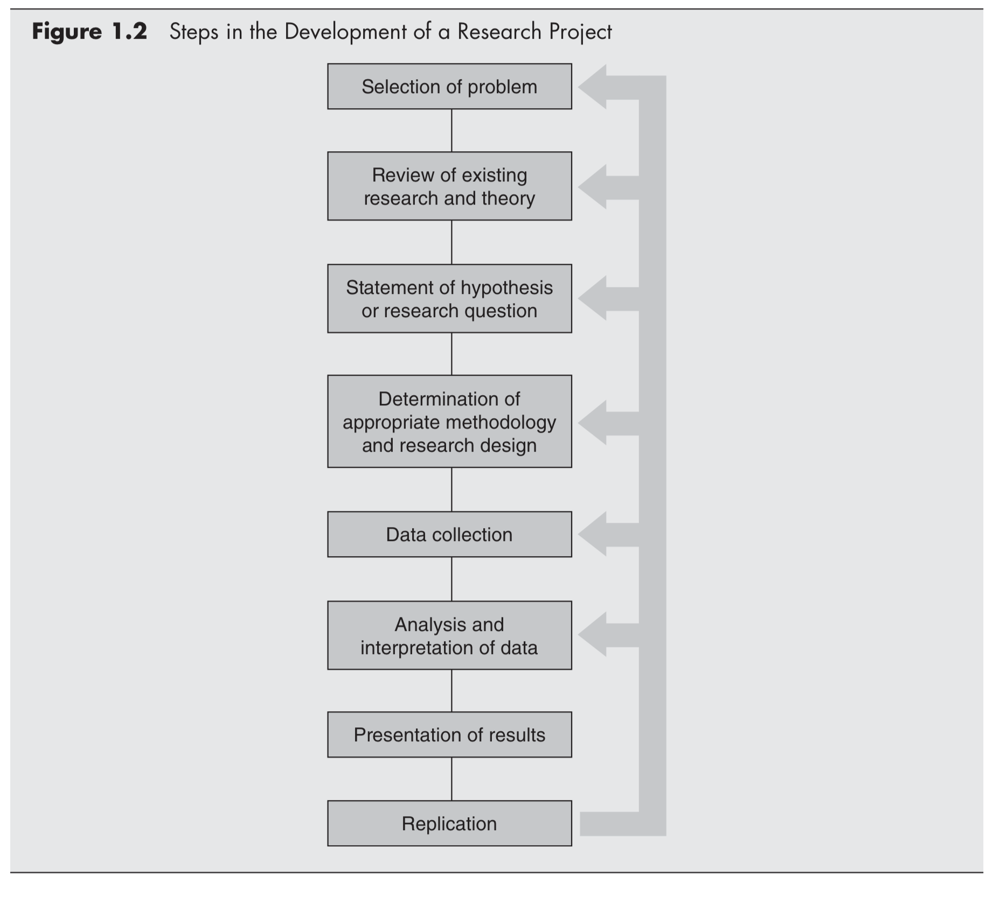
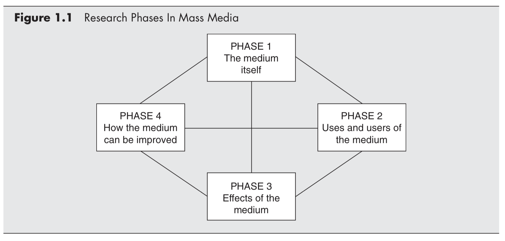

## Agenda
1. Introductions
2. Go over **syllabus**
3. Talk about **IRB certification**
4. Characteristics of **scientific research**
5. Projects for **mass media research**
6. Preview of **statistics**

# Syllabus

---

## Instructor
- Mike Kearney, PhD
- Office: 314 Lee Hills Hall
- Hours: By appointment
- Email: kearneymw@missouri.edu
- Phone: (573) 884-0424

---

## Texts

- Wimmer, R.D., & Dominick, J.R. (2011). *Mass media research: An
  introduction* (9th Ed.). Belmont, CA: Wadsworth.
- Grolemund,  G. & Wickham, H. (2017). *R for Data Science*, First
  Edition. [http://r4ds.had.co.nz/](http://r4ds.had.co.nz/)
- You should also stay abreast of research in your interest area by
  reading appropriate scholarly and professional journals

---

## Requirements

- Weekly readings
- Methods course survey (due today)
- IRB certification (see: next slide)
- Homework assignments (R stats)
- Two exams
- Final paper (proposal)

---

## Research paper

- The final paper is a research proposal
- It must include a **brief** summary of pertinent literature,
  identification of applicable theories, and a clear statement of the
  value of the study
- However, the primary emphasis will be on research design, methods,
  and plan of data analyses.

---

## Research paper cont'd

- Topic is chosen by you, in consultation with me.
- Research question for your research paper (proposal) is due on the 6th week of
class.
- Presentations a week before the last week of classes
- Final paper is due the last week of class

---

## Grades

The following is a percentage breakdown of the grades in this course:

| Assignment           | Percent  |
|----------------------|:--------:|
| Exam #1              | 25%      |
| Exam #2              | 25%      |
| Research paper       | 25%      |
| Homework assignments | 25%      |
| **Total**            | **100%** |

---

## Grading scale

This course uses a plus/minus grading scale.

| Percent     | Grade |
|-------------|-------|
| 93.4 - 100  | A     |
| 90.0 - 93.3 | A-    |
| 86.7 - 89.9 | B+    |
| 83.4 - 86.6 | B     |
| 80.0 - 83.3 | B-    |
| 76.7 - 79.9 | C+    |
| 73.4 - 76.6 | C     |
| 70.0 - 73.3 | C-    |
| 00.0 - 69.9 | F     |

---

## Final note on grades

- Percentages are exact
- I do not offer extra credit or give incompletes. 
- If you have any questions or concerns about an assignment it is best to ask them before the assigned due date
- Late work is penalized by 10% [of the original assigned value] per 24 hours until it is submitted or ceases to be.

---

## Schedule

| Week | Date | Topic                   |   W&D |     G&W |   Due |
|-----:|-----:|-------------------------|------:|--------:|------:|
|    1 | 1/16 | Intro to quant research |   1,3 |         |       |
|    2 | 1/23 | Operationalization      |   2,4 |         |       |
|    3 | 1/30 | Survey research         |     3 |         |       |
|    4 | 2/06 | Experimental research   |     9 |         |       |
|    5 | 2/13 | Content/text analysis   |     6 |         |       |
|    6 | 2/20 | Intro to #rstats        |       | 1,4,6,8 |    RQ |
|    7 | 2/27 | Descriptive statistics  |    10 |   3,5,7 |   HW1 |
|    8 | 3/06 | Chisquare and t-test    | 11,12 |         |   HW2 |
|    9 | 3/13 | **Exam #1**             |       |         |       |

---

## Schedule cont'd

| Week | Date | Topic                   |   W&D |     G&W |   Due |
|-----:|-----:|-------------------------|------:|--------:|------:|
|   10 | 3/20 | Correlation and factors |    12 |         |   HW3 |
|   11 | 3/27 | **SPRING BREAK**        |       |         |       |
|   12 | 4/03 | General linear model    |       |   22-25 |   HW4 |
|   13 | 4/10 | Advanced models         |     8 |         |   HW5 |
|   14 | 4/17 | **Exam #2**             |       |         |       |
|   15 | 4/24 | Presentations           |       |         |       |
|   16 | 5/01 | **WORK DAY**            |       |         | Paper |

 

**W&D** = Wimmer, R.D., & Dominick, J.R. (2011). *Mass media research: An
  introduction* (9th Ed.).

**G&W** = Grolemund,  G. & Wickham, H. (2017). *R for Data Science*, First
  Edition. [http://r4ds.had.co.nz/](http://r4ds.had.co.nz/)

# IRB

---

## Institutional Review Board

- The first assignment in this course is to acquire IRB certification
- Mizzou IRB website: https://research.missouri.edu/irb/

---

## IRB training

- To complete your training, login to ecompliance: https://ecompliance.missouri.edu/
- Click "Institutional Review Board"
- Under 'Prequisites' select "Take IRB training"
- Follow instructions (this may take multiple hours)
- Print out certification

# Scientific research

---

## Research

- The text book defines **research** as

> an attempt to discover something. <cite>- Wimmer & Dominick, 2011, p. 2</cite>

---

## Scientific research

- The text book defines **scientific research** as

> Scientific research is an organized, objective, controlled,
> qualitative or quantitative empirical analysis of one or more
> variables. <cite>- Wimmer & Dominick, 2011, p. 9</cite>

---

## Methods of knowing

Four approaches to knowing: tenacity, intuition, authority, and science

- **Tenacity** - true because it always has been
- **Intuition** - true because it is self evidence
- **Authority** - true because qualified source says so
- **Scientific** - true because studies provisionally support it

---

## Characteristics of the scientific method

Wimmer and Dominick describe the following five characteristics of
the scientific method:

1. Scientific research is **public**
2. Science is **objective**
3. Science is **empirical**
4. Science is **systematic** and **cumulative**
5. Science is **predictive**

---

## Characteristics of the scientific method

Here's another list of five characteristics from [sciencing.com](https://sciencing.com/five-characteristics-scientific-method-10010518.html)

1. Scientific research is **empirical**
2. Scientific research is **replicable**
3. Scientific research is **provisional**
4. Scientific research is **objective**
5. Scientific research is **systematic**

---

## Theory

- The text book defines **theory** as

> a set of related propositions that presents a systematic view of phenomena by specifying relationships among concepts. <cite>- Wimmer & Dominick, 2011, p. 13</cite>

---

## Measurements of objectivity

- **Validity** refers to **accuracy** of findings
- **Reliability** refers to **consistency** of findings

# Mass media research topics

---

## Mass media

- The text book defines **mass media** as

> any form of communication that simultaneously reaches a large number of people, including but not limited to radio, TV, newspapers, magazines, billboards, films, recordings, books, and the Internet. <cite>- Wimmer & Dominick, 2011, p. 2</cite>

---

## Research process

---

## Research phases

# Statistics

---

## Statistics we will cover
- Sampling/probability
- Descriptive statistics
- Inferential statistics
  - Correlation/regression
  - t-test/ANOVA
  - Overview of advanced methods

---

## Sampling
- What does the word **random** mean? Describe it using mathematical terms.

