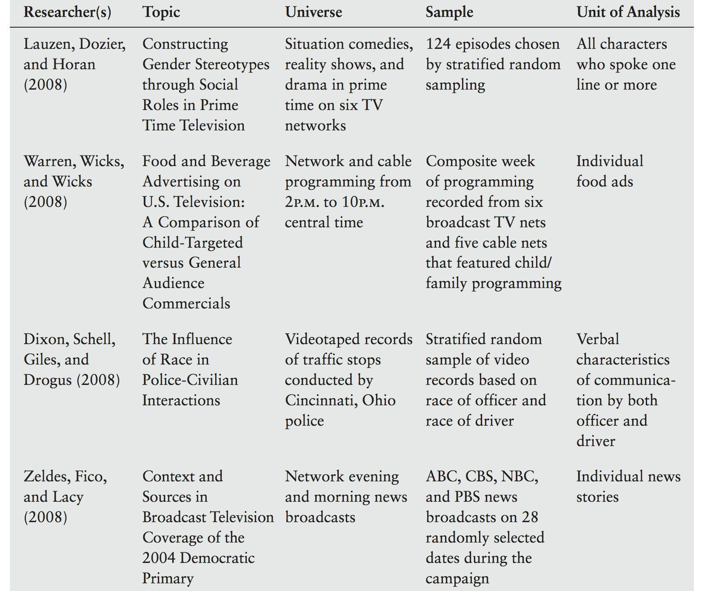
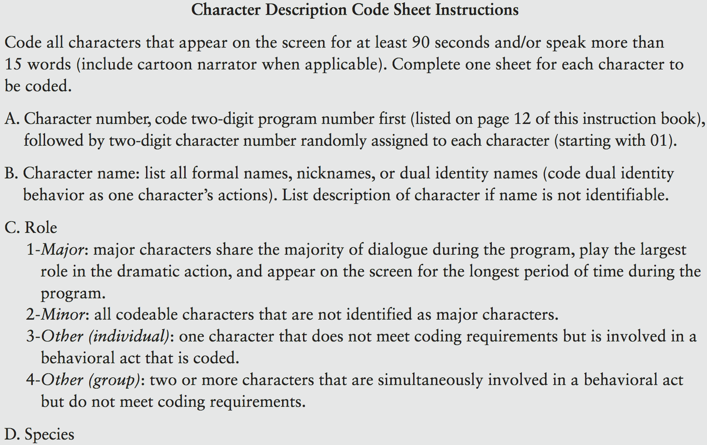

```{r setup, include=FALSE}
```


# Recap and overview

## Research designs
> + **Surveys**
>     - Best method for observational snapshots/understanding
>     - Easy to administer and useful for exploratory analyses
>     - Difficult & expensive to get representative sample
> + **Experiments**
>     - Works with convenient samples
>     - Makes it possible to test for causality
>     - Assumed IV can be manipulated and can be labour intensive 

## Overview
+ **Content Analysis**
    - Definition, uses, & limitations
    - Steps to conducting content analysis
    - Example/practice
+ **Text analysis**
    - Definition, uses, & limitations
    - Steps to conducting text analysis
    - Example/practice

# Content analysis

## Definition

> Content analysis is a method of studying and analyzing communication in a **systematic**, **objective**, and **quantitative** manner for the purpose of measuring variables.

<p style="text-align:right"> -Kerlinger (2000)</p>

> 1. Systematic
> 1. Objective
> 1. Quantitative


## Uses
> 1. Describing communication content
> 1. Testing hypotheses of message characteristics
> 1. Comparing media content to the "real world"
> 1. Assessing the image of particular groups in society
> 1. Establishing a starting point for studies of media effects

## Limitations
> 1. By itself, content analysis cannot make causal claims
> 1. Findings reflect definitions/categories in study design
> 1. Depends on availability of messages
> 1. Time consuming and expensive!

# Conducting content analysis
  
## Steps
<div class="double">
<p class="double-flow">
> 1. Formulate RQ/H
> 1. Define the universe/context
> 1. Select sample from population
> 1. Define unit of analysis
> 1. Construct content categories
> 1. Establish quantification system
> 1. Train coders and pilot
> 1. Code content
> 1. Analyze collected data
> 1. Draw conclusions
</p>
</div>

## 1. Formulate RQ/H
- Review literature and consider relevant theory

## 2. Define universe
- Operationalize concepts, specifying boundaries of the content

## 3. Select sample
+ Determine if finite/accessible
+ Multi-stage sampling
    - Subset by source/type/date
    - Try to stratify/subset **randomly**

## 4. Unit of analysis
+ What comprises a single element for the analysis?
    - Word, sentence, paragraph, article, etc.
+ Definition should be guided by context

## 

## 5. Content categories
> 1. **Emergent coding** establishes categories after a preliminary examination of the data
> 1. **a priori coding** establishes the categories before the data are collected, based on some theoretical or conceptual rationale

<br>
<p style="text-align:right;" class="note">Categories should be mutually exlusive, exhaustive, and reliabile</p>

## 6. Quantification system
+ **Nominal**
    - Topic of content unit
+ **Interval**

|             |               |              |
|-------------|---------------|--------------|
| Indpenedent | 1  2  3  4  5 | Dependent    |
| Dominant    | 1  2  3  4  5 | Submissive   |

+ **Ratio**
    - Number of sentences/minutes

## 7. Train coders
+ Typically two or three coders
+ Inter-coder reliability
    - Careful training
    - Traning session
    - Pilot study

## 8. Coding content
+ Code book/standardized coding form


## 

## 9. Analyze data
+ We'll talk about stats later this semester

## 10. Draw conclusions
+ In relation to RQ/H
+ Implications for practice, theory, and future research

# Activity

## Activity
+ Our task is to code user reviews of Star Wars The Last Jedi
    - Link: https://www.rottentomatoes.com/m/star_wars_the_last_jedi/reviews/?type=user
+ With a partner, come up with a RQ/H and a coding scheme to test it

<style>
img {width: 80%;
height: auto;
margin-left: 10%;
}
</style>
