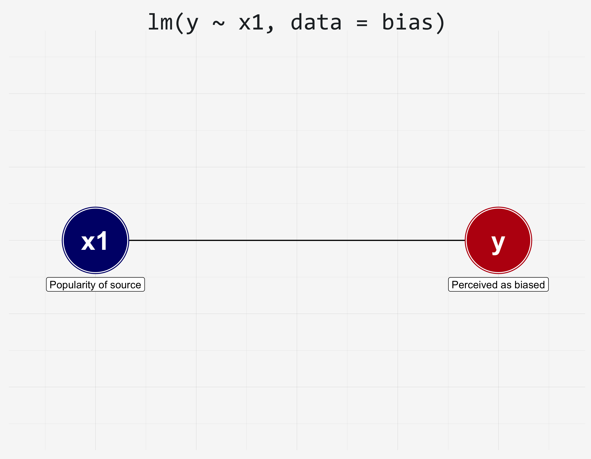
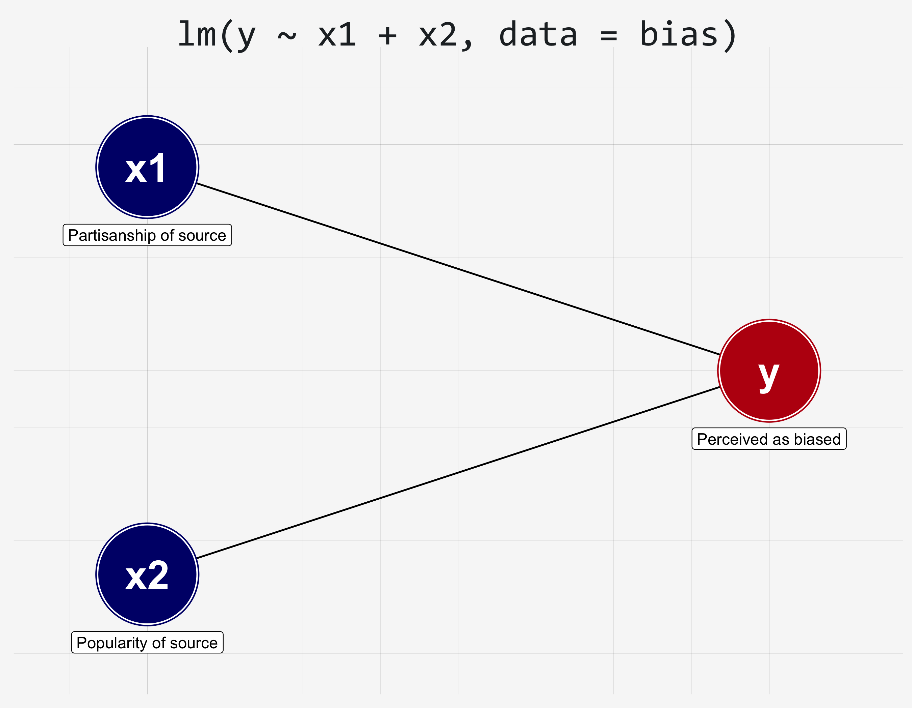
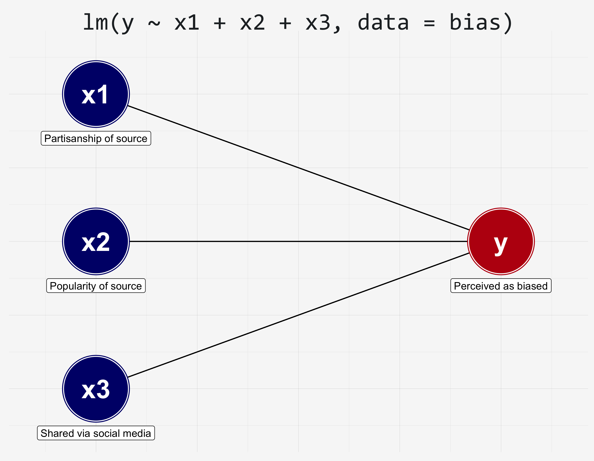
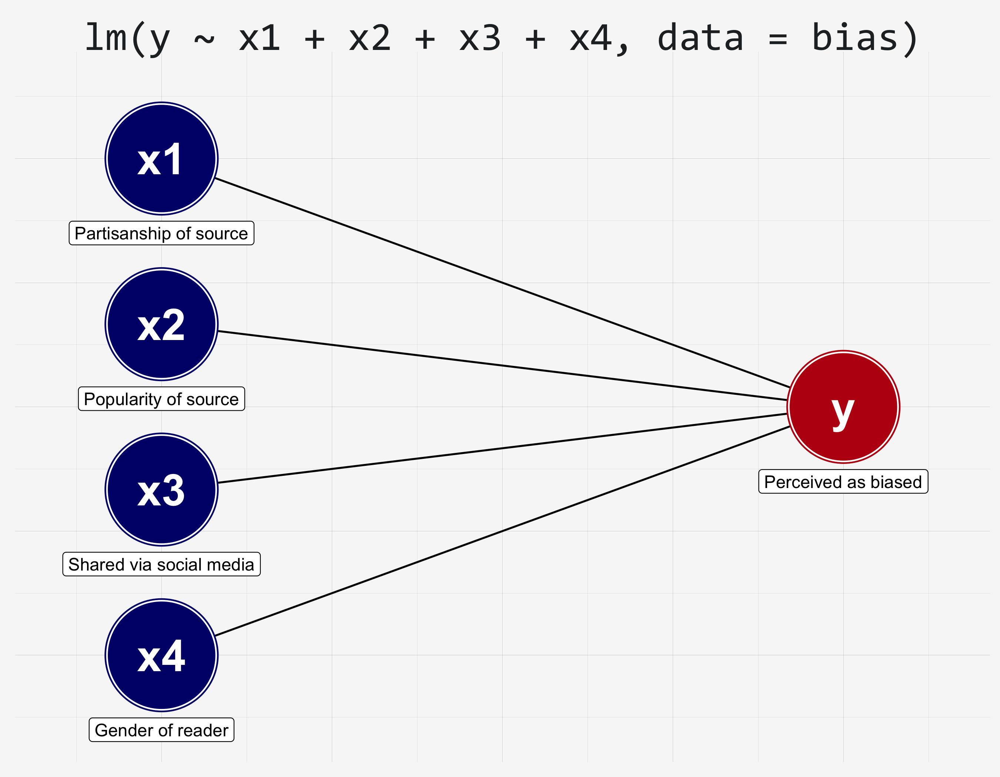

```{r setup, include=FALSE}
knitr::opts_chunk$set(echo = TRUE, eval = TRUE, collapse = TRUE, comment = ">")
options(htmltools.dir.version = FALSE)
htmltools::tagList(rmarkdown::html_dependency_font_awesome())
head <- function(x, n = 6) {
  x <- utils::head(x, n)
  knitr::kable(x, format = "html")
}
```

# \#rstats

Visualizations and data wrangling in [R](https://cran.r-project.org/) via the [tidyverse](https://tidyverse.org), a collection of likeminded data science packages.

```{r, comment=">"}
## load the tidyverse
library(tidyverse)
```

---

# A note about terminology

It's still important to understand the different levels of measurement, but moving forward–for the sake of simplicity–I will mostly refer to variables as either **continuous** (ordinal, interval, ratio) or **categorical** (nominal).

- **Continuous** variables are of class `integer` or `numeric`

- **Categorical** variables are of class `character` or `factor`

.footnote[**Dichotomous** variables are categorical variables with only **two** levels; in R these are most often represented as `logical` (TRUE FALSE) or `integer` with `1`s (`TRUE`s) and `0`s (`FALSE`s).]

---

# General linear model

The general **linear model (lm)** is a statistical analysis method used to describe the relationship(s) between one continuous outcome (**dependent**) and one or more predictor (**independent**) variables.

- **Outcome** variable must be **continuous
- **Predictor** variable(s) can be **continuous** or **categorical**

.footnote[This should not be confused with the general**ized** linear model (glm), which is for non-continuous/non-normal outcome variables. But don't worry about that for now; we'll cover it next semester!]

---

# Linear model (big picture)

The general **linear model** describes two traditions to modeling the prediction of outcome variables. 

1. **Analysis of variance (ANOVA)**: experimentalists compared outcome variables in different experimental conditions (**categorical predictors**)

2. **Regression**: survey/observational researchers examined relationships between observed variables (**continuous variables**)

.footnote[Both models do the same thing with either categorical or continous predictors. My advice: if you're doing experiments with many levels of interactions, use ANOVA framework; otherwise, use regression.]

---

# Linear model

**Regression** and **ANOVA** are often taught as two different classes, which is fine, but that should not lead you to believe they are truly distinct things

They are **mathematically equivalent**. They are both general linear models–statistical tools used to describe linear relationships between outcome and predictor(s).

---

# Some example data

I'm going to generate some example data. We'll use this to visualize the relationship between two variables.

---

10 observations from a random normal distribution

```{r}
(x <- rnorm(10))
```

10 observations from a random normal distribution **plus `x`**

```{r}
(y <- rnorm(10) + x)
```

Stored as a data frame.

```{r}
(df <- data.frame(x, y))
```

---

# tidyverse note:

Instead **data.frame**s I often use **tibble**s, which are a special type of `data.frame`. Their benefits are:

- Avoid common factor-related errors
- Nice printing

```{r}
## another way to store you data [as a data frame]
tibble::as_tibble(df)
```


---

```{r fig.height=6, fig.width=8}
## scatter plot
ggplot(df, aes(x, y)) + 
  geom_point() + 
  labs(title = "Scatter plot of y by x")
```

---

# `x ~~ y`

**Correlation analysis** describes the **direction** and **strength** of the relationship between x and y.

The **order** of the variables (x and y) does **not** matter, e.g., `y ~~ x` or `x ~~ y`

---

# `y ~ x`

**Regression (linear model) analysis** describes the **slope (or linear relationship)** between x and y.

In other words, regression models predict the value of `y` (outcome) based on the value of `x` (predictor).

The **order** definitely **matters**–regression is all about modeling the prediction of a **single outcome variable**, using one or more predictor variables.

---

# How to conduct a regression

1. Get the **data** frame object
1. Write the model **formula**
1. Pass **formula** and **data** to `lm()` (linear model function), storing out put as a **m[0-9]**odel object.
1. Pass **m[0-9]** object to `summary()`

---

# 1. Get the **data** object

Usually this will involve reading in the data, e.g.,

```{r}
#data <- read.csv("mydataset.csv")
```

Or, in our case, we have the `df` object we created earlier.

```{r}
df
```

---

# 2. Write the model formula

Use `formula()` and start with the name of the outcome variable. Use the `~` symbol to divide outcome from predictors.

```{r}
formula <- formula(y ~ x)
```

When using multiple predictors, separate each predictor with `+` (plus signs)

```{r, eval=FALSE}
formula(y ~ x1 + x2)
```


---

# 3. Pass **formula** and **data** to `lm()`

Use `lm()` to run the regression. Make sure to store output (use whatever naming system you like)

```{r}
m1 <- lm(formula = formula, data = df)
```

You can also do this directly

```{r, eval=FALSE}
m1 <- lm(y ~ x, data = df)
```


---

# 4. Pass `m1` to `summary()`

```{r}
summary(m1)
```


---

# New data

```{r}
## perceived bias in news article
y <- rnorm(10, 0, 1)

## partisanship of source
x1 <- rnorm(10, 0, 1) + df$y

## popularity of source
x2 <- rnorm(10, 0, .2) - df$y

## whether viewed via social media
x3 <- (rnorm(10, 0, 3) + df$y) > 0

## gender of reader
x4 <- sample(c("man", "woman", "trans", "other"), 10, replace = TRUE)
```

---

```{r}
## data frame
bias <- data.frame(y, x1, x2, x3, x4)
bias
```

---




---

```{r}
m1 <- lm(y ~ x1, data = bias)
summary(m1)
```

---



---

```{r}
m1 <- lm(y ~ x1 + x2, data = bias)
summary(m1)
```

---



---

```{r}
m1 <- lm(y ~ x1 + x2 + x3, data = bias)
summary(m1)
```


---



---

```{r}
m1 <- lm(y ~ x1 + x2 + x3 + x4, data = bias)
summary(m1)
```


