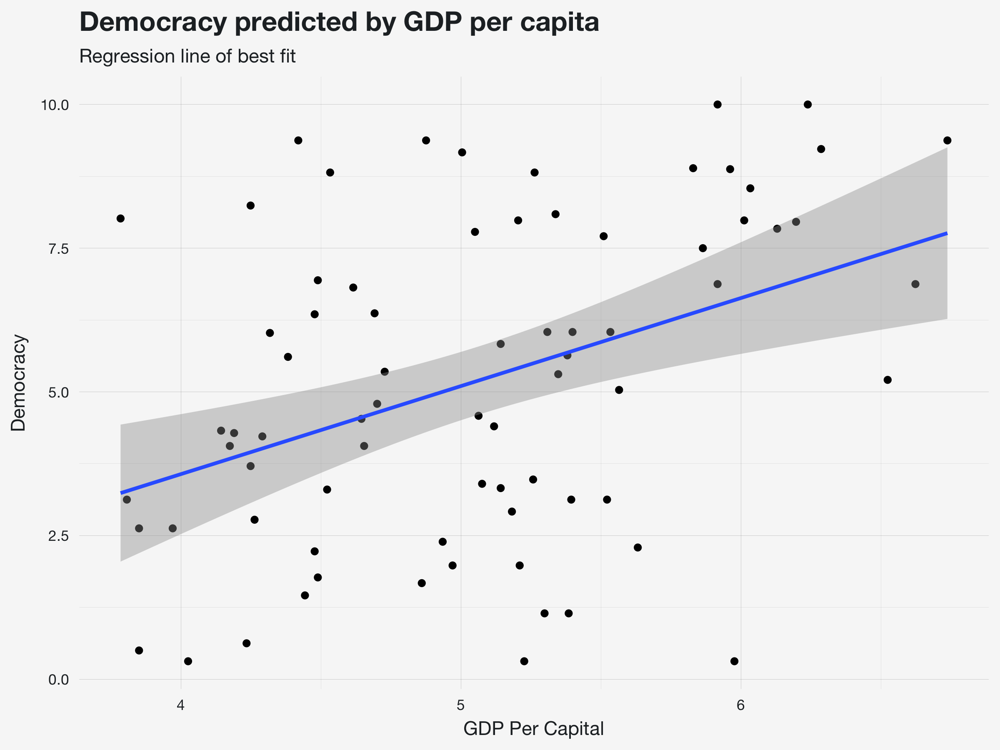
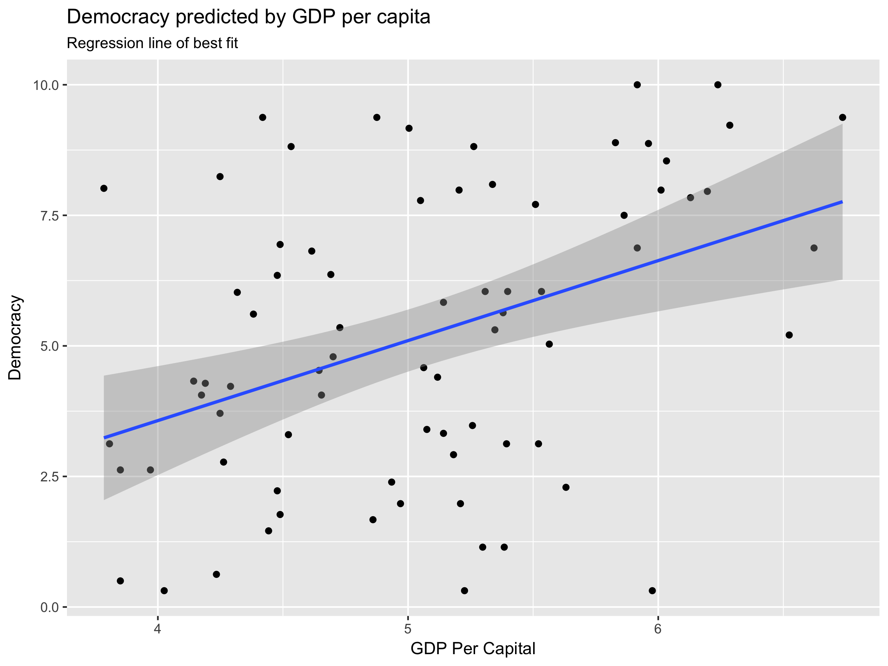
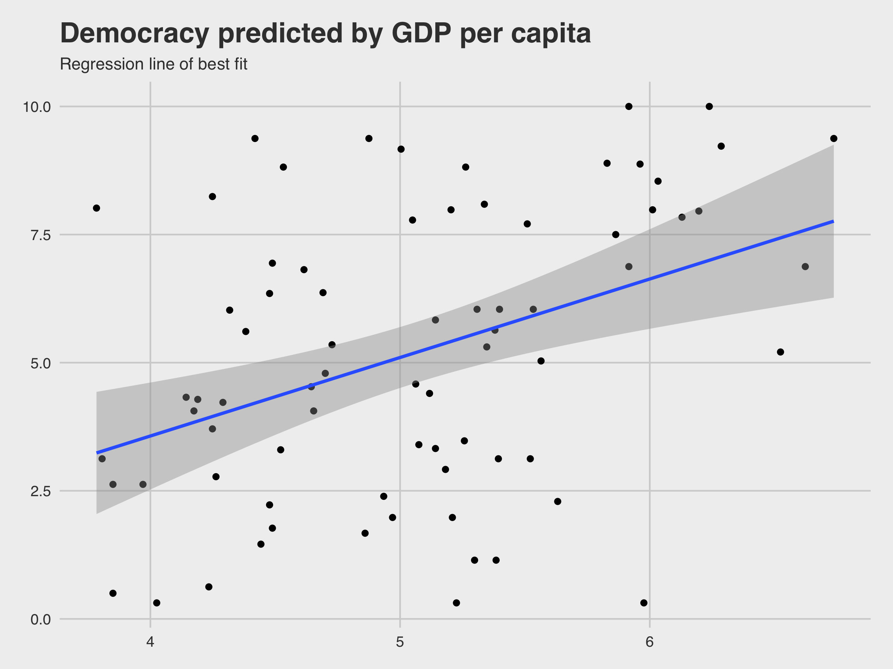
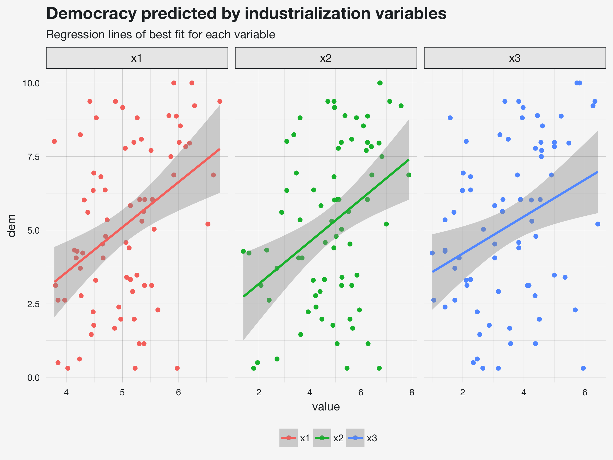

```{r setup, include=FALSE}
knitr::opts_chunk$set(echo = TRUE, eval = TRUE, collapse = TRUE, comment = ">")
options(htmltools.dir.version = FALSE)
htmltools::tagList(rmarkdown::html_dependency_font_awesome())
head <- function(x, n = 6) {
  x[sapply(x, is.numeric)] <- lapply(x[sapply(x, is.numeric)], round, 2)
  x <- utils::head(x, n)
  knitr::kable(x, format = "html")
}
```

# \#rstats

Visualizations and data wrangling in [R](https://cran.r-project.org/) via the [tidyverse](https://tidyverse.org), a collection of likeminded data science packages.

```{r, comment=">"}
## load the tidyverse
library(tidyverse)
```

---

# Last time

+ Defined **general linear model** and discussed when to use it
  - Linear model includes both **regression** (continuous predictors) and **ANOVA** (categorical predictors)
+ Generated example data for **linear model (regression) analysis**
  - **One outcome variable** predictor by **one or more predictor variables**
+ Described the **steps to running a linear model**
  - **Read** the data
  - Write the model **formula**
  - Run the **model**
  - **Summarize** the model

---

# General linear model

The general **linear model (lm)** is a statistical analysis method used to describe the relationship(s) between one continuous outcome (**dependent**) and one or more predictor (**independent**) variables.

- **Outcome** variable must be **continuous
- **Predictor** variable(s) can be **continuous** or **categorical**

.footnote[This should not be confused with the general**ized** linear model (glm), which is for non-continuous/non-normal outcome variables. But don't worry about that for now; we'll cover it next semester!]

---

# data set

The example data is a subset of the `PoliticalDemocracy` data set found in the **{lavaan}** package.

Read in the data.

```{r}
pd <- read.csv("data/PoliticalDemocracy.csv")
```

View the first 6 rows

```{r}
head(pd)
```

---

# Democracy variables

+ **y1**: Expert ratings of the freedom of the press in 1960
+ **y2**: The freedom of political opposition in 1960
+ **y3**: The fairness of elections in 1960
+ **y4**: The effectiveness of the elected legislature in 1960

```{r}
head(dplyr::select(pd, y1:y4))
```

---

## Industrialization variables

+ **x1**: The gross national product (GNP) per capita in 1960
+ **x2**: The inanimate energy consumption per capita in 1960
+ **x3**: The percentage of the labor force in industry in 1960

```{r}
head(dplyr::select(pd, x1:x3))
```

---

# Composite variable

Calculate the mean of the democracy variables

**With base R**

```{r}
pd$dem <- (pd$y1 + pd$y2 + pd$y3 + pd$y4) / 4
pd$dem <- rowMeans(subset(pd, select = y1:y4), na.rm = TRUE)
```

**With the tidyverse**

```{r}
pd <- mutate(pd, dem = (y1 + y2 + y3 + y4) / 4)
```

**With the tidyverse using the pipe `%>%`**

```{r}
pd <- pd %>% 
  mutate(dem = (y1 + y2 + y3 + y4) / 4)
```

---

# Data set

View the updated data set (with the new variable)

```{r}
head(pd)
```

---

Plot `dem ~ x` using **{ggplot2}**

1. Start plot `ggplot()` and map values `aes()`
1. Plot points `geom_point()`
1. Plot line of best fit `geom_smooth()`
1. Adjust labels `labs()`

```{r, eval=FALSE}
ggplot(pd, aes(x = x1, y = dem)) + 
  geom_point() + 
  geom_smooth(method = "lm") + 
  labs(x = "GDP Per Capital", y = "Democracy",
    title = "Democracy predicted by GDP per capita",
    subtitle = "Regression line of best fit")
```


```{r, include=FALSE, fig.show="hide"}
ggplot(pd, aes(x = x1, y = dem)) + 
  geom_point() + 
  geom_smooth(method = "lm") + 
  labs(x = "GDP Per Capital", y = "Democracy",
    title = "Democracy predicted by GDP per capita",
    subtitle = "Regression line of best fit") + 
  theme_mwk() + 
  ggsave("img/demx1.png", width = 8, height = 6, units = "in")
```

.footnote[I use my own personal **{ggplot2}** theme `theme_mwk()` from my **{tfse}** package (on Github).]

---

<p align="center"> </p>

---

Default ggplot2 theme

```{r, include=FALSE, fig.show="hide"}
ggplot(pd, aes(x = x1, y = dem)) + 
  geom_point() + 
  geom_smooth(method = "lm") + 
  labs(x = "GDP Per Capital", y = "Democracy",
    title = "Democracy predicted by GDP per capita",
    subtitle = "Regression line of best fit") + 
  ggsave("img/demx1-gray.png", width = 8, height = 6, units = "in")
```

<p align="center"> </p>

---

Using `ggthemes::theme_fivethirtyeight()`

```{r, include=FALSE, fig.show="hide"}
ggplot(pd, aes(x = x1, y = dem)) + 
  geom_point() + 
  geom_smooth(method = "lm") + 
  labs(x = "GDP Per Capital", y = "Democracy",
    title = "Democracy predicted by GDP per capita",
    subtitle = "Regression line of best fit") + 
  ggthemes::theme_fivethirtyeight() + 
  ggsave("img/demx1-538.png", width = 8, height = 6, units = "in")
```


<p align="center"> </p>

---

Gather from wide-format to long-format


```{r}
pd_long <- pd %>%
  dplyr::select(x1:x3, dem) %>%
  tidyr::gather(x, value, -dem)
```


View long-format data

```{r}
head(pd_long, 3)
head(dplyr::filter(pd_long, x == "x2"), 3)
```

---

Plot using **{ggplot2}**

To depict multiple categories as multiple different plots, use `facet_wrap()`


```{r eval=FALSE}
ggplot(pd_long, aes(x = value, y = dem, color = x)) + 
  geom_point() + 
  geom_smooth(method = "lm") + 
  labs(title = "Democracy predicted by industrialization variables",
    subtitle = "Regression lines of best fit for each variable") + 
  theme(legend.position = "bottom") + 
  facet_wrap(~ x, scales = "free_x") 
```

```{r, include=FALSE, fig.show="hide"}
ggplot(pd_long, aes(x = value, y = dem, color = x)) + 
  geom_point() + 
  geom_smooth(method = "lm") + 
  labs(title = "Democracy predicted by industrialization variables",
    subtitle = "Regression lines of best fit for each variable") + 
  theme_mwk() + theme(legend.position = "bottom") + 
  facet_wrap(~ x, scales = "free_x") + 
  ggsave("img/demx.png", width = 8, height = 6, units = "in")
```

---

<p align="center"> </p>

---

# How to conduct a regression

1. Get the **data** frame object
1. Write the model **formula**
1. Pass **formula** and **data** to `lm()` (linear model function), storing out put as a **m[0-9]**odel object.
1. Pass **m[0-9]** object to `summary()`


---

# Model

Run a model predicting democracy by `x1` `x2` `x3`

```{r, eval=FALSE}
m1 <- lm(dem ~ x1 + x2 + x3, data = pd)
summary(m1)

> Call:
> lm(formula = dem ~ x1 + x2 + x3, data = pd)
> 
> Residuals:
>     Min      1Q  Median      3Q     Max 
> -6.1874 -2.0898  0.1027  1.8815  4.8031 
> 
> Coefficients:
>             Estimate Std. Error t value Pr(>|t|)
> (Intercept)  -1.5919     2.9754  -0.535    0.594
*> x1            1.1059     0.9355   1.182    0.241
*> x2            0.3856     0.5186   0.744    0.460
*> x3           -0.1860     0.4146  -0.449    0.655
> 
> Residual standard error: 2.601 on 71 degrees of freedom
> Multiple R-squared:  0.1681,    Adjusted R-squared:  0.1329 
> F-statistic: 4.781 on 3 and 71 DF,  p-value: 0.004316
```

---

```{r, include=FALSE}
m1 <- lm(dem ~ x1 + x2 + x3, data = pd)
```

# Collinearity

When predictors are strongly correlated, you get inaccurate estimates.

```{r}
cor(select(pd, x1:x3))
```

One way to test is finding the **Variance Inflation Factors (VIF)**. If it's above 2, it's usually worth investigating.

```{r}
car::vif(m1)
```

---

```{r}
corrplot::corrplot(cor(select(pd, x1:x3)))
```


---

# x1

```{r, eval=FALSE}
m2 <- lm(dem ~ x1, data = pd)
summary(m2)

> Call:
> lm(formula = dem ~ x1, data = pd)
> 
> Residuals:
>     Min      1Q  Median      3Q     Max 
> -6.2840 -2.0478  0.1496  1.9139  5.1643 
> 
> Coefficients:
>             Estimate Std. Error t value Pr(>|t|)    
> (Intercept)  -2.5581     2.0861  -1.226 0.224038    
*> x1            1.5318     0.4085   3.750 0.000352 ***
> ---
> Signif. codes:  0 '***' 0.001 '**' 0.01 '*' 0.05 '.' 0.1 ' ' 1
> 
> Residual standard error: 2.576 on 73 degrees of freedom
> Multiple R-squared:  0.1615,    Adjusted R-squared:   0.15 
> F-statistic: 14.06 on 1 and 73 DF,  p-value: 0.0003519
```

---


# x2

```{r, eval=FALSE}
m3 <- lm(dem ~ x2, data = pd)
summary(m3)

> Call:
> lm(formula = dem ~ x2, data = pd)
> 
> Residuals:
>     Min      1Q  Median      3Q     Max 
> -6.2515 -2.0562  0.0213  1.9186  4.4811 
> 
> Coefficients:
>             Estimate Std. Error t value Pr(>|t|)    
> (Intercept)   1.7416     1.0015   1.739 0.086254 .  
*> x2            0.7184     0.1994   3.602 0.000573 ***
> ---
> Signif. codes:  0 '***' 0.001 '**' 0.01 '*' 0.05 '.' 0.1 ' ' 1
> 
> Residual standard error: 2.592 on 73 degrees of freedom
> Multiple R-squared:  0.1509,    Adjusted R-squared:  0.1393 
> F-statistic: 12.97 on 1 and 73 DF,  p-value: 0.0005732
```

---

# x3

```{r, eval=FALSE}
m4 <- lm(dem ~ x3, data = pd)
summary(m4)

> Call:
> lm(formula = dem ~ x3, data = pd)
> 
> Residuals:
>     Min      1Q  Median      3Q     Max 
> -6.3713 -2.1512  0.4066  2.1165  4.8682 
> 
> Coefficients:
>             Estimate Std. Error t value Pr(>|t|)    
> (Intercept)   2.9524     0.8435   3.500 0.000797 ***
*> x3            0.6273     0.2207   2.842 0.005804 ** 
> ---
> Signif. codes:  0 '***' 0.001 '**' 0.01 '*' 0.05 '.' 0.1 ' ' 1
> 
> Residual standard error: 2.669 on 73 degrees of freedom
> Multiple R-squared:  0.09964,    Adjusted R-squared:  0.08731 
> F-statistic: 8.079 on 1 and 73 DF,  p-value: 0.005804
```


---

Calculate mean of `x1` `x2` `x3`

```{r}
pd$ind <- (pd$x1 + pd$x2 + pd$x3) / 3
```

Then model using aggregated variable

```{r, eval=FALSE}
m5 <- lm(dem ~ ind, data = pd)
summary(m5)

> Call:
> lm(formula = dem ~ ind, data = pd)
> 
> Residuals:
>     Min      1Q  Median      3Q     Max 
> -6.4813 -2.1241  0.0037  2.0388  4.7622 
> 
> Coefficients:
>             Estimate Std. Error t value Pr(>|t|)    
> (Intercept)   1.0612     1.2055   0.880 0.381580    
*> ind           0.9228     0.2613   3.531 0.000721 ***
> ---
> Signif. codes:  0 '***' 0.001 '**' 0.01 '*' 0.05 '.' 0.1 ' ' 1
> 
> Residual standard error: 2.599 on 73 degrees of freedom
> Multiple R-squared:  0.1459,    Adjusted R-squared:  0.1342 
> F-statistic: 12.47 on 1 and 73 DF,  p-value: 0.0007209
```


