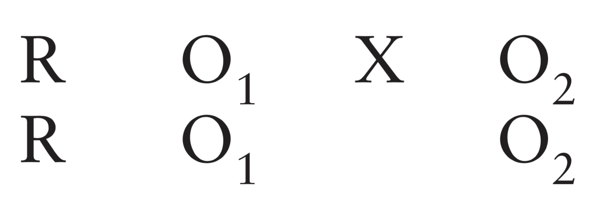
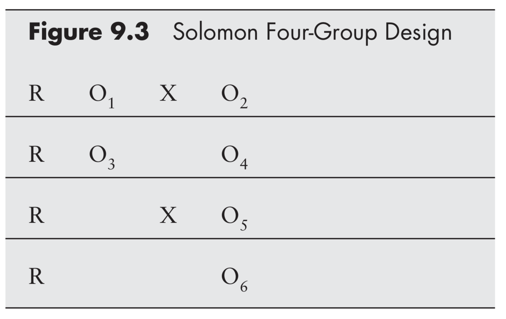
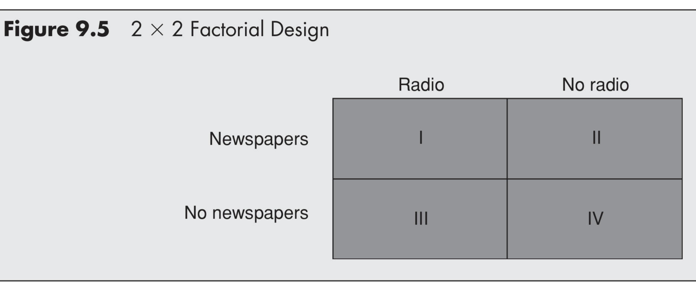
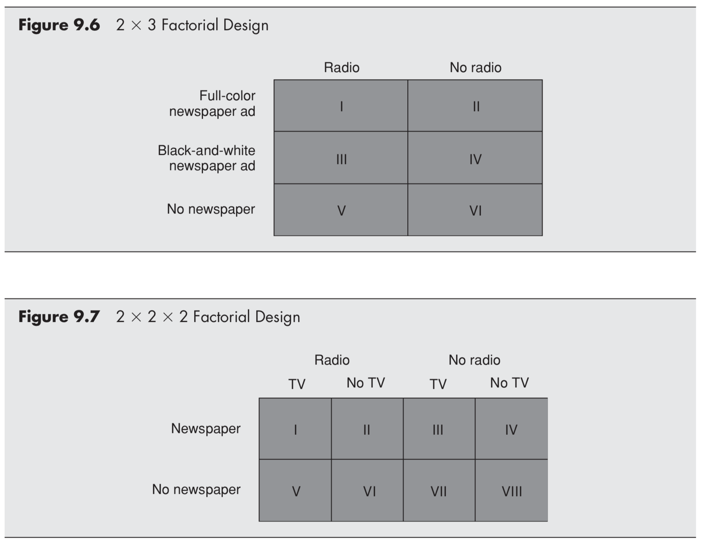

```{r setup, include=FALSE}
```


# Recap and overview

## Surveys
> + Last week's talk by Dr. Ben "Jumpshot" Warner from Communication Department
> + Why use surveys?
> + Why not?


## Overview
+ Background concepts
+ Experimental research
+ Experimental designs
  - Pre-test / post-test
  - Control/comparison
  - Factorial
  - Quasi/field

# Background concepts

## Reliability and validity
> + Reliability = consistency
>     - Approximate this with statistics
> + Validity = accuracy
>     - Internal: soundness of study design
>     - External: generalizability
>         - Representative sample
>         - Ecologically valid

## Confounding variables
+ Confounding variables are unintended forces that are responsible for variation 

## 

## Dealing with confounds
+ Two ways to control for confounding variables
  1. Randomization (random sample/assignment)
  2. Incorporate the confound into study design (measure/control)

# Experimental research

## What is an experiment?
+ What makes something an experiment?

## Why do an experiment?
+ When would an experiment be better than a survey?
+ When would a survey be better than an experiment?

## Advantages of lab experiments
+ Evidence of causality
+ Control
+ Cost
+ Replication

## Disadvantages of lab experiments
+ Artificiality
+ Researcher bias
+ Limited scope

## Experimental research
> 1. Select setting
> 2. Select experimental design
> 3. Operationalize variables
> 4. Decide how to manipulate independent variable
> 5. Select and assign subjects to experimental conditions
> 6. Conduct a pilot study / manipulation check
> 7. Administer the experiment
> 8. Analyze and interpret the results


# Experimental designs

## Defining features
+ There are two defining features of experimental designs
    - When the measurement occurs
    - How the groups are determined

## Pre-test/post-test
+ One classic experimental design involves a pre-test and a post-test

+ Allows measurement of change *within* subjects
+ Allows control over variations in starting points

## Post-test only
+ An increasingly common measurement design is to only conduct a post-test

+ Less expensive
+ Avoids re-measurement confound

## Solomon 4-group


## Control/comparison
+ Experiments must include two or more groups
+ When a comparison is made against the *absence* of something, we call that group the **control** group
+ When a comparison is made between two different *types* of something, we call them comparison groups

## Factorial designs
+ For more complex designs, groups are often exposed to multiple different experimental manipulations
+ This is called a factorial design because it makes more sense to think about the groups in relation to factors rather than as each their unique group


## 

## Repeated measures


## Quasi-experimental designs
+ Conduct an experiment without perfect random assignment

## Pre/post nonequiv control


## Field experiments
+ Sacrifice internal validity for external validity
+ Can be expensive and difficult to administer ethically

## Online survey experiments
+ Experiments are increasingly being conducted on line (the internet is beautiful)
+ Survey experiments and cheap and easy, but can suffer from poor ecological validity and respondent recall/attention

## A/B testing
+ Same principles with some different technical implementation details 
+ Outcome variables are impressions, engagements, clicks, buys, shares, revisits, etc.

<style>
img {width: 80%;
height: auto;
margin-left: 10%;
}
</style>
