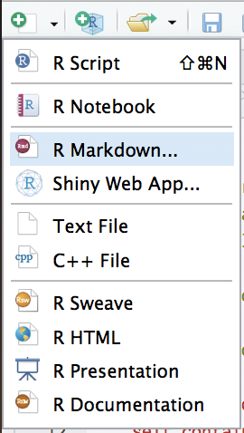

```{r setup, include=FALSE}
knitr::opts_chunk$set(echo = TRUE, comment = "#>")
Sys.setenv(
  USLIDES_BOTTOMLEFT = "uslidelogos/bl.jpg",
  USLIDES_BOTTOMRIGHT = "uslidelogos/br.jpg",
  USLIDES_BANNER = "uslidelogos/bn.jpg",
  USLIDES_BACKGROUND = "uslidelogos/bg.jpg"
)
```

## Rmarkdown
+ The **{rmarkdown}** package provides a simple front-end framework that (a) is well integrated into R uses and functions and (b) plays well with others front-end frameworks (html, PDF, even Word docs)
+ **Rstudio**, in particular, makes it easy to access cool rmarkdown features
+ Thus, this presentation provides a brief introduction to **rmarkdown**

## What is markdown?
+ **Markdown** is a simple markup language written in plain text. It's how I make all these slides and write papers
+ **Rmarkdown** is a version of markdown that integrates the R environment (code and output) via **code chunks**

## How do I use it?
+ In **Rstudio** select the new file dropdown (or `File > New File`) and then select **R Markdown**.



## Render
+ To render the `.Rmd` file, click the **knit** button on the top pane of the script file. 


## Very simple rules:
+ R code exists inside of **code chunks**
    - Every time you click `knit`, the file [and the code] is executed
+ Everything outside of code chunks gets converted to HTML text (similar to Word).
    - There are lots of good examples and tutorials online, just google "Rmarkdown tutorials"

